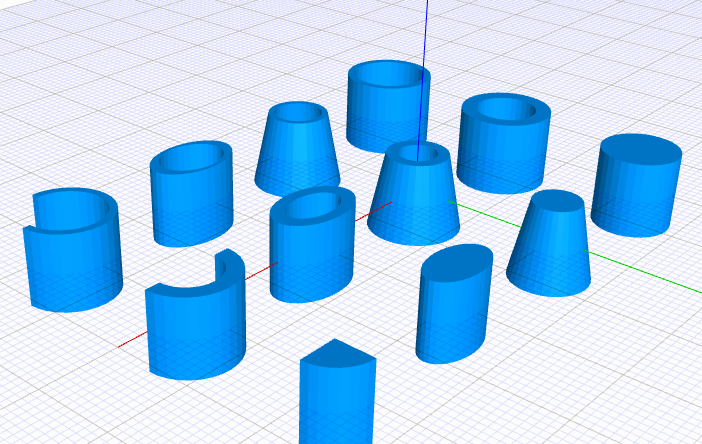

# JSCAD Extended Cylinder Primitives

This package provides an extended cylinder primitive for JSCAD, offering flexible ways to create solid cylinders, hollow cylinders, and pipes with various cross-sections and profiles.

## Usage

### cylinder(options)

Creates a solid cylinder, hollow cylinder, or pipe with optional elliptical cross-sections. This is an enhanced wrapper around JSCAD's `cylinderElliptic()`.

```javascript
// Solid cylinder examples
const uniformCylinder = cylinder({ radius: 5 })
const taperedCylinder = cylinder({ radius: [5, 3] })
const ellipticalCylinder = cylinder({ radius: [[5, 3], [5, 3]] })
const partialCylinder = cylinder({ radius: 5, angle: [0, Math.PI/2] })

// Hollow cylinder examples
const uniformHollow = cylinder({ outer: 6, inner: 4 })
const taperedHollow = cylinder({ outer: [6, 4], inner: [4, 2.5] })
const ellipticalHollow = cylinder({
    outer: [[6, 4], [6, 4]],
    inner: [[4, 2.5], [4, 2.5]]
})

// Pipe examples
const uniformPipe = cylinder({ outer: 6, wall: 1 })
const taperedPipe = cylinder({ outer: [6, 4], wall: [1, 0.8] })
const variableWallPipe = cylinder({
    outer: [[6, 4], [6, 4]],
    wall: [[1.5, 0.5], [1.5, 0.5]]
})
```

### Options

The cylinder function accepts the following options:

#### Basic Parameters
- `height`: Number - Height of the cylinder (default: `1`)
- `segments`: Number - Number of segments (default: `32`)
- `center`: Array [x, y, z] - Center position (default: `[0, 0, 0]`)
- `angle`: Array [start, end] - Start and end angles in radians (default: `[0, TAU]`)

#### Dimension Parameters
You can specify dimensions using one of these parameter combinations:

1. Solid Cylinder:
   - `radius`: Defines the cylinder's outer dimensions

2. Hollow Cylinder:
   - `outer`: Outer radius specification
   - `inner`: Inner radius specification

3. Pipe:
   - `outer`: Outer radius specification
   - `wall`: Wall thickness specification

All dimension parameters (radius, outer, inner, wall) support these formats:
1. Single number: Uniform circular value
   ```javascript
   radius: 5  // Circle with radius 5
   ```

2. Array [start, end]: Tapered circular value
   ```javascript
   radius: [5, 3]  // Tapers from radius 5 to 3
   ```

3. Array of arrays: Elliptical values
   ```javascript
   radius: [[5, 3], [5, 3]]  // Elliptical with x=5, y=3
   ```

### Defaults

- `height`: 1
- `segments`: 32
- `center`: [0, 0, 0]
- `angle`: [0, TAU] (full rotation)
- Inner radius: 80% of outer radius if not specified
- Wall thickness: 20% of outer radius if not specified

## Features

The cylinder primitive supports:
- Solid, hollow, and pipe geometries
- Circular and elliptical cross-sections
- Optional tapering from start to end
- Partial rotations using the angle parameter
- Positioning using the center parameter
- Segment count control for detail level
- Variable wall thickness for pipes

## Implementation Notes

The function uses the `cylinderElliptic()` JSCAD primitive internally and applies boolean operations to create hollow geometries. Wall thickness specifications for pipes are automatically converted to inner radius values based on the outer dimensions.
