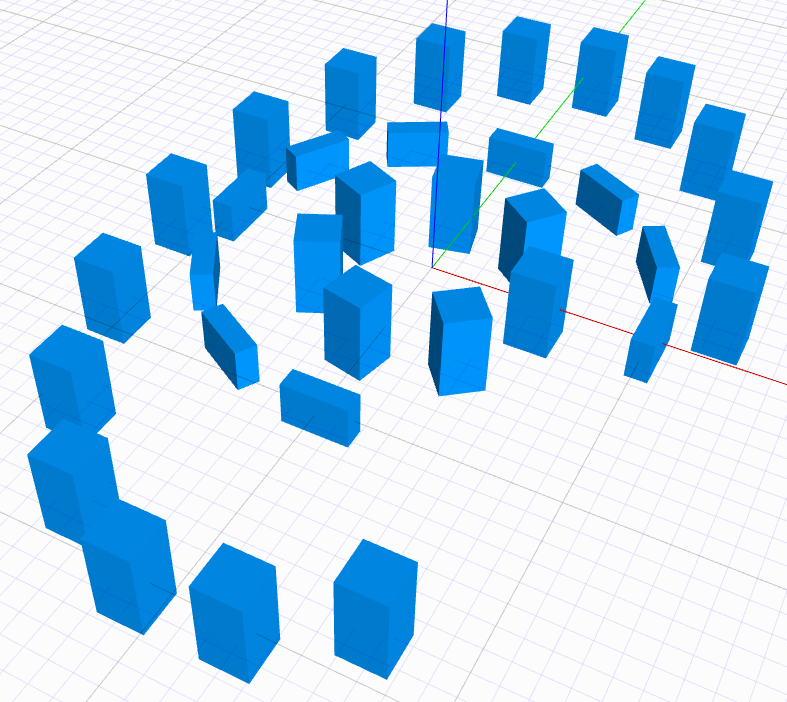

# JSCAD Rotated Placement

A utility for arranging shapes in circular or elliptical patterns with optional rotation.

## Features

- Place objects in circular or elliptical arrangements
- Specify count, radius/dimensions, and angle range
- Optional rotation of objects to match their position
- TypeScript-friendly with full type definitions
- Comprehensive input validation

## Usage

```javascript
const { rotatedPlacement } = require('jscad-rotated-placement');

// Create a circle of 8 cubes
const cube = primitives.cube();
const pattern = rotatedPlacement({
    count: 8,
    radius: 10,
    rotate: true
}, cube);

// Create an elliptical pattern
const elliptical = rotatedPlacement({
    count: 12,
    width: 30,
    height: 20,
    start: 0,
    end: 270
}, cube);
```

## API

### rotatedPlacement(options, shape)

Places copies of a shape in a circular or elliptical pattern.

```javascript
const options = {
    count: 16,      // Number of items (default: 16)
    radius: 10,     // Circle radius (overrides width/height)
    width: 20,      // Ellipse width (default: 20)
    height: 20,     // Ellipse height (default: 20)
    start: 0,       // Start angle in degrees (default: 0)
    end: 360,       // End angle in degrees (default: 360)
    rotate: false   // Rotate items to match position (default: false)
};
```

## License

MIT
